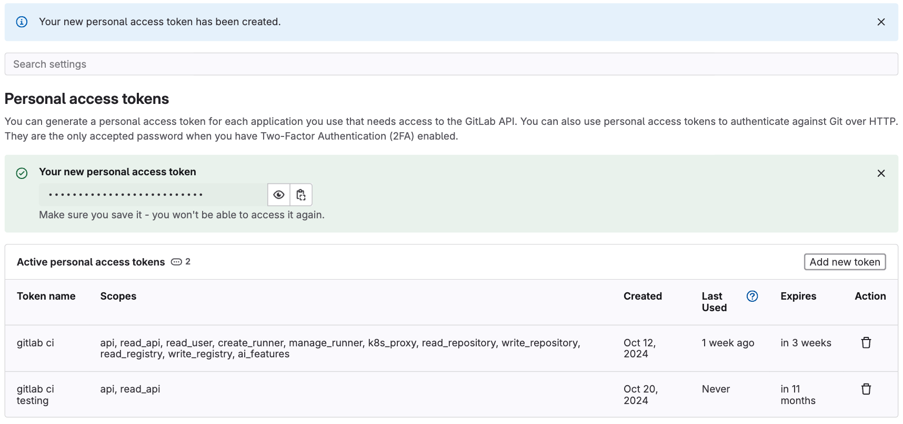
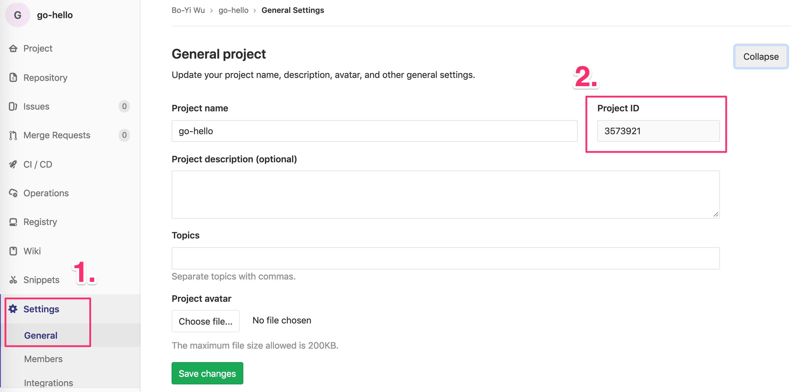

# drone-gitlab-ci


[繁體中文](./README.zh-tw.md) | [简体中文](./README.zh-cn.md) | [English](./README.md)

[](https://github.com/appleboy/drone-gitlab-ci/actions/workflows/testing.yml)
[](https://github.com/appleboy/drone-gitlab-ci/actions/workflows/trivy.yml)
[](https://godoc.org/github.com/appleboy/drone-gitlab-ci)
[](https://codecov.io/gh/appleboy/drone-gitlab-ci)
[](https://goreportcard.com/report/github.com/appleboy/drone-gitlab-ci)

[Drone](https://www.drone.io/) plugin for trigger [gitlab-ci](https://about.gitlab.com/solutions/continuous-integration/) jobs.

## GitLab Setting

See the detail documentation for [Pipeline trigger tokens API](https://docs.gitlab.com/ee/api/pipeline_triggers.html). You can create personal access tokens to authenticate with:

1. The GitLab API.
2. GitLab repositories.
3. The GitLab registry.

See the [GitLab token overview](https://docs.gitlab.com/ee/security/tokens/index.html#personal-access-tokens).



How to get the project ID? going to your project’s `Settings ➔ General` under Gerneral project.



## Build or Download a binary

The pre-compiled binaries can be downloaded from [release page](https://github.com/appleboy/drone-gitlab-ci/releases). Support the following OS type.

- Windows amd64/386
- Linux amd64/386
- Darwin amd64/386

With `Go` installed

```sh
go install github.com/appleboy/drone-gitlab-ci
```

or build the binary with the following command:

```sh
make build
```

## Usage

There are three ways to trigger gitlab-ci jobs.

### Usage from binary

trigger job.

```bash
drone-gitlab-ci \
  --host https://gitlab.com/ \
  --token XXXXXXXX \
  --ref master \
  --project-id gitlab-ci-project-id
```

Enable debug mode.

```diff
drone-gitlab-ci \
  --host https://gitlab.com/ \
  --token XXXXXXXX \
  --ref master \
  --project-id gitlab-ci-project-id
+ --debug
```

### Usage from docker

trigger job.

```bash
docker run --rm \
  -e GITLAB_HOST=https://gitlab.com/
  -e GITLAB_TOKEN=xxxxx
  -e GITLAB_REF=master
  -e GITLAB_ID=gitlab-ci-project-id
  appleboy/drone-gitlab-ci
```

Enable debug mode.

```bash
docker run --rm \
  -e GITLAB_HOST=https://gitlab.com/ \
  -e GITLAB_TOKEN=xxxxx \
  -e GITLAB_REF=master \
  -e GITLAB_ID=gitlab-ci-project-id \
  -e GITLAB_DEBUG=true \
  appleboy/drone-gitlab-ci
```

### Usage from drone ci

Execute from the working directory:

```sh
docker run --rm \
  -e PLUGIN_HOST=https://gitlab.com/ \
  -e PLUGIN_TOKEN=xxxxx \
  -e PLUGIN_REF=master \
  -e PLUGIN_ID=gitlab-ci-project-id \
  -e PLUGIN_DEBUG=true \
  -v $(pwd):$(pwd) \
  -w $(pwd) \
  appleboy/drone-gitlab-ci
```

You can get more [information](DOCS.md) about how to use scp plugin in drone.

## Testing

Test the package with the following command:

```sh
make test
```
